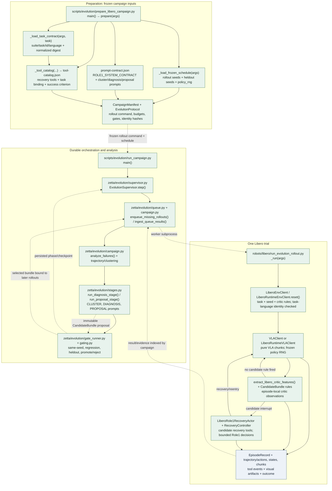
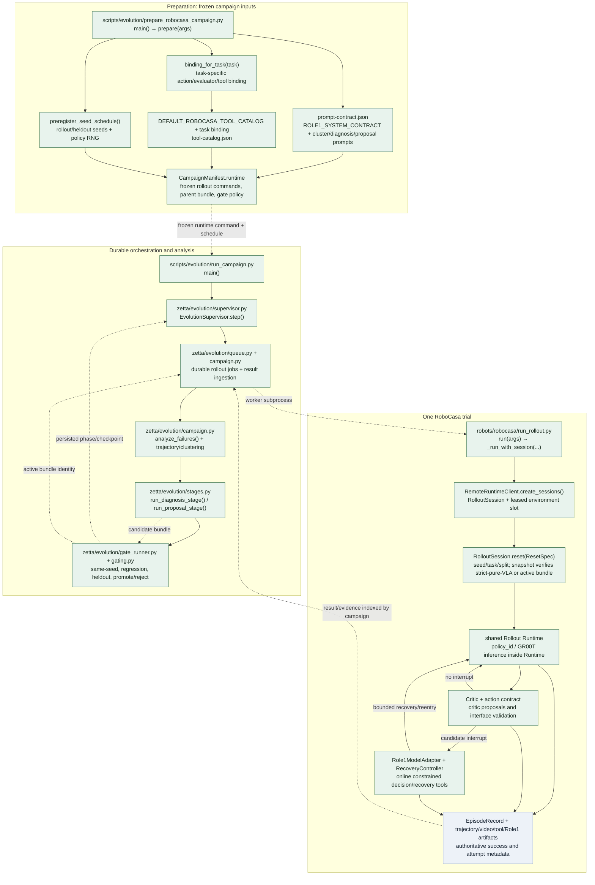

# Evolution Learning Pipelines: Structure Review

This document maps the learning path from campaign preparation through rollout,
failure analysis, candidate authoring, and evaluation. Solid arrows are direct
calls or materialized data flow. Dashed arrows are subprocess, queue, or
artifact handoffs. Red nodes/arrows mark missing, ignored, or nonfunctional
contracts in the ARX path; they do not imply that ARX's server-hosted VLA or
RGB-only learning design is itself a defect.

The Libero and RoboCasa paths share Zetta's durable campaign state machine.
Their reset/evaluator semantics and online evidence differ; the diagrams retain
those distinctions rather than treating one backend's contract as universal.

## 1. Libero



**Contract and information flow.** Preparation freezes task language, prompt
hashes, tool catalog, seed/policy-RNG schedule, rollout command, and gate
protocol. The supervisor materializes queue jobs; workers invoke one rollout
per logical trial. A rollout resets a seeded environment, records initial
identity and trajectory, runs VLA with candidate critic/recovery when a bundle
is present, then returns an `EpisodeRecord` and visual/tool evidence. The
campaign indexes results, clusters failures, runs offline diagnosis/proposal,
and evaluates immutable bundles on preregistered same-seed/regression/heldout
gates. Libero may expose bounded privileged critic evidence under its explicit
campaign policy; that evidence is not an ARX requirement.

## 2. RoboCasa



**Contract and information flow.** Preparation binds the task-specific tool
contract, prompt contract, catalog, seed schedule, parent bundle, and runtime
commands. A worker creates a Runtime session and leased slot; reset evidence
confirms whether the episode is a strict pure-VLA baseline or uses a frozen
active bundle. VLA inference is served inside Runtime. Candidate critic/action
contract signals may invoke Role1 and bounded recovery; all outcomes and
artifacts are returned to the same durable queue/campaign lifecycle used by
Libero. RoboCasa's privileged-tool configuration and Runtime-hosted policy are
backend-specific contracts, not assumed for ARX.

## 3. ARX + MuJoCo

```mermaid
flowchart TB
  subgraph prep[Preparation entry]
    P["scripts/evolution/prepare_arx_campaign.py<br/>main()"]
    REG["scenes.json → trial_registry.train<br/>scene/mapping/task/model_contract/seed"]
    CFG["configs/arx/learning_gpt56_sol_low.json<br/>learner settings only"]
    CONTRACT["campaign_contract.json<br/>contract v2, labels for train/regression/heldout"]
    P --> REG --> CONTRACT
    CFG --> CONTRACT
    MISS_PROMPT["MISSING: frozen prompt-contract.json,<br/>complete task/prompt/schedule/gate identities"]
    CONTRACT -. no prompt contract emitted .-> MISS_PROMPT
  end

  subgraph learner[Learning controller: implemented scaffold, disconnected lifecycle]
    CLI["scripts/evolution/run_arx_learning.py<br/>main()"]
    SESSION["zetta/evolution/arx/session.py<br/>LearningSession.automated()/turn()"]
    TOOLS["zetta/evolution/arx/tools.py<br/>LearningTools.request_rollouts()/read_evidence()/evaluate_candidate()"]
    ADAPTER["zetta/evolution/arx/tool_adapter.py<br/>build_toolkit() → typed learner tools"]
    COORD["zetta/evolution/arx/coordinator.py<br/>CampaignCoordinator.run()"]
    STORE["zetta/evolution/arx/store.py<br/>LearningStore evidence/checkpoint store"]
    CLI --> SESSION --> ADAPTER --> TOOLS
    TOOLS --> COORD
    TOOLS --> STORE
    BROKEN_GATE["BROKEN: evaluate_candidate() returns an ID only;<br/>no replay/contract/development/paired/regression/heldout runner"]
    TOOLS -. placeholder only .-> BROKEN_GATE
    BROKEN_FLOW["BROKEN: automated() runs fixed COLLECT/ANALYZE/AUTHOR turns;<br/>no durable phase machine or resume of groups/drafts/evidence"]
    SESSION -. fixed loop .-> BROKEN_FLOW
  end

  subgraph rollout[One ARX deployment trial]
    RCLI["scripts/deployment/run_arx_evolution_rollout.py<br/>main() → RolloutRunner.run()"]
    TRIAL["robots/arx/deployment/contracts.py<br/>Trial: baseline | candidate"]
    RUNNER["robots/arx/deployment/runner.py<br/>preflight() → start() → loop() → cleanup()"]
    GATEWAY["scripts/deployment/serve_arx_gateway.py<br/>fresh single-episode Gateway process"]
    RESET["robots/arx/gateway/session_core.py<br/>EpisodeCore.reset(): task.start_state; one-use episode"]
    Z["robots/arx/gateway/zeva.py + cosmos_edge_client.py<br/>remote VLA server request"]
    CRITIC["robots/arx/critics/registry.py + gateway/session_core.py<br/>RGB feature extraction → proposal/interrupt"]
    AGENT["robots/arx/deployment/agent.py<br/>fresh API planner per recovery decision"]
    EVID["attempt output: result.json, events/, tools/, invocations/, frames"]
    RCLI --> TRIAL --> RUNNER --> GATEWAY --> RESET --> Z --> CRITIC
    CRITIC -->|no interrupt| Z
    CRITIC -->|recovery interrupt| RUNNER --> AGENT --> RUNNER
    RUNNER --> EVID
    GATEWAY --> EVID
  end

  CONTRACT -. contract .-> CLI
  COORD -. launches rollout subprocess .-> RCLI
  CFG -. learner config is copied into deployment.agent .-> BROKEN_CFG["BROKEN: planner_type=codex is not Trial AgentSettings planner_type=api"]
  COORD -. starts local Zeva server unconditionally .-> BROKEN_SERVER["BROKEN for server-hosted setup: duplicate/local VLA startup"]
  COORD -. request arm/config handling .-> TRIAL
  BROKEN_ARM["BROKEN: parent arm ignored; baseline hardcoded;<br/>candidate only if in-memory active package matches"]
  COORD -. current arm mapping .-> BROKEN_ARM
  EVID -. only result summary stored; raw attempt evidence not indexed .-> STORE
  BROKEN_EVID["MISSING FLOW: learner cannot read events/tools/frames<br/>despite prompt requesting them"]
  STORE -. result-only ingest .-> BROKEN_EVID
  CONTRACT -. split labels but no trial registry blocks .-> BROKEN_SPLITS["BROKEN: regression/heldout labels have no corresponding trials"]

  classDef normal fill:#e8f3ed,stroke:#39734d,color:#17271c;
  classDef data fill:#edf2f8,stroke:#496985,color:#172331;
  classDef broken fill:#fde8e7,stroke:#bd342d,color:#4a1714,stroke-width:2px;
  class P,REG,CFG,CONTRACT,CLI,SESSION,TOOLS,ADAPTER,COORD,STORE,RCLI,TRIAL,RUNNER,GATEWAY,RESET,Z,CRITIC,AGENT normal;
  class EVID data;
  class MISS_PROMPT,BROKEN_GATE,BROKEN_FLOW,BROKEN_CFG,BROKEN_SERVER,BROKEN_ARM,BROKEN_EVID,BROKEN_SPLITS broken;
```

**Contract and information flow.** The rollout side is substantially more
complete than the learner orchestration side: each `Trial` is validated,
starts one fresh gateway episode at the manifest-defined state, calls the
remote Zeva service, and runs observation-only RGB critics. An interrupt
launches a fresh deployment planner and records attempt artifacts. However,
the campaign layer does not currently carry that lifecycle through learning:
the coordinator hardcodes baseline before its candidate branch, ignores the
request's trial configuration, launches a local Zeva server, and candidate
agent settings are sourced from the learner config. The evidence store receives
only the result summary, while no gate implementation completes candidate
evaluation. The fixed automated session checkpoints empty hypotheses/evidence
and has no campaign restart protocol for requests, job groups, or drafts.

The diagram intentionally does **not** mark the following as defects:

- ARX's VLA being hosted remotely. The diagram marks only the coordinator's
  unconditional extra local-server startup as inconsistent with that setup.
- ARX learning from public RGB and execution evidence without privileged
  simulator state.
- ARX's one-use, fresh-reset episodes. Its gateway explicitly rejects episode
  reset/resume, which is a valid starting contract; campaigns should create a
  new trial rather than resume a physical episode.

## Reading the ARX labels

- **MISSING** means a required contract or data-flow edge is absent from the
  current implementation (for example prompt freezing or evidence indexing).
- **BROKEN** means code exists but ignores, contradicts, or cannot satisfy the
  adjacent contract (for example `evaluate_candidate()` is a placeholder).
- Green nodes are implemented code paths, not an assertion that every possible
  runtime configuration has been verified.

The red links in the ARX diagram are semantic annotations, not test output.
This is a source-structure review; the focused tests could not be run in the
available Python environment because `pytest` is not installed there.
